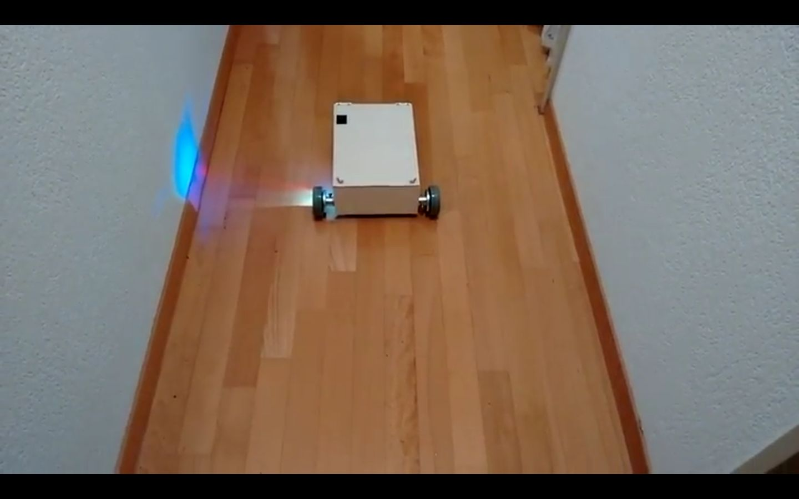

# Deedee Robot

Deedee robot for remote development

## Platform

Size: length 30 cm, width 32 cm (with wheels), width without wheels 21 cm

The main axis (and center of rotation) is 2.5cm from the front side.

Maximal speed: approx 0.4m/s

Wheel perimeter and encoders resolution: (unknown)

## Sensors

* Asus Xtion [https://www.asus.com/3D-Sensor/Xtion_PRO/] (old, supports USB2 only)

## Links

First motion video (not remote yet): https://youtu.be/FZ1uHYhY-Uk

